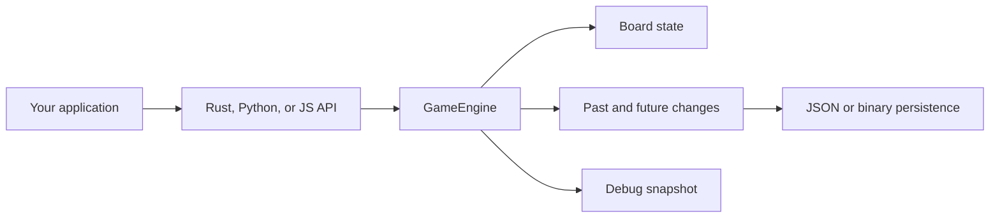

# dots-core: how it works

`dots-core` keeps the game rules in one Rust engine and generates language-specific wrappers around that engine. The same state transitions, validation errors, undo/redo behavior, and serialization format are used from Rust, Python, and JavaScript/WASM.

## Runtime model



A `GameEngine` owns the mutable state. Consumers do not receive mutable references to internal fields. Properties such as `edges`, `board_state`, `past`, and `future` return copies or language-owned values, so inspection cannot accidentally change the engine.

## A move

1. The caller selects a player and board coordinate.
2. The engine validates the player, bounds, occupancy, and blocking rules.
3. The engine applies the state transition and records a `Change` in `past`.
4. The current player, turn, scores, board state, and edge map are updated.
5. Any previously redoable changes are discarded when a new move branches history.

A failed move returns an error and does not partially update the board.

## State inspection

The main read-only values are:

| Value | Meaning |
| --- | --- |
| `current_player` / `currentPlayer` | Player expected to move next. |
| `turn` | One-based turn number. |
| `scores` | Scores in player order: player 0, then player 1. |
| `config` | Board dimensions, starting dots, and scoring mode. |
| `edges` | Each point mapped to its neighbouring points. |
| `board_state` / `boardState` | Cell ownership, blocking player, and edge flag. |
| `past` | Applied changes in chronological order. |
| `future` | Changes available to `redo`. |

These values are intended for rendering, replay controls, diagnostics, and tests.

## Undo and redo

`undo()` moves the latest change from `past` to `future` and restores the earlier state. `redo()` moves the next change from `future` back to `past` and reapplies it. Both return `true` when the operation changed the state and `false` when there was nothing to do.

## Persistence

`to_json()` / `toJson()` and `to_bytes()` serialize the complete history, including the game configuration. `from_json()` / `fromJson()` and `from_bytes()` restore an engine from that history. Pass `view_only = true` when loading a replay that should be inspectable but not editable.

The serialized history is the portable boundary between sessions. The live derived state is rebuilt by the engine rather than being trusted from an external snapshot.

## Debugging

`debug()` returns a compact, human-readable snapshot. It is useful in a console, test failure, or bug report when a full structured export would be too noisy. For programmatic inspection, prefer the structured properties or `history()`.

## Browser and bundler builds

Use the `web` target when the browser imports the generated files directly:

```bash
wasm-pack build --target web --out-dir pkg --features javascript
```

Use the `bundler` target for Vite, webpack, Rollup, or another JavaScript bundler:

```bash
wasm-pack build --target bundler --out-dir pkg --features javascript
```

The web target must be served over HTTP. The server should return the `.wasm` file as `application/wasm`; `python -m http.server` does this automatically. Opening the HTML with `file://` is not supported because browsers restrict module and WASM loading from local files.
